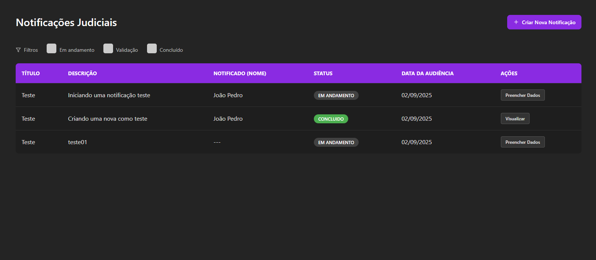

# Lawgic System - Frontend

Esta é a interface de usuário (UI) para o sistema de gerenciamento de Notificações Judiciais, construída com React.

## 🖼️ Sobre a Interface

Este projeto é a parte visual do sistema, responsável por consumir a API que construímos em NestJS e apresentar uma experiência de usuário limpa e funcional. A interface permite que o usuário gerencie todo o ciclo de vida de uma notificação judicial, desde sua criação até a validação final.

O design foi pensado para ser simples e intuitivo, com um tema escuro para conforto visual e feedback claro em todas as ações.

## 📸 Tela Principal




## ✨ O que dá pra fazer?

- ✔️ **Visualizar** todas as notificações em uma tabela limpa e organizada.
- ✔️ **Filtrar** as notificações por status (`Em Andamento`, `Validação`, `Concluído`).
- ✔️ **Criar** uma nova notificação do zero através de um modal interativo.
- ✔️ **Avançar** uma notificação no fluxo de trabalho (Preencher Dados, Validar).
- ✔️ **Visualizar** os detalhes de qualquer notificação, com os campos bloqueados.
- ✔️ **Receber feedback visual** com validação de formulários em tempo real (email, telefone).

## 🛠️ A Caixa de Ferramentas (Frontend)

- **Biblioteca Principal:** [React](https://react.dev/)
- **Build Tool:** [Vite](https://vitejs.dev/)
- **Roteamento:** [React Router DOM](https://reactrouter.com/)
- **Cliente HTTP (API):** [Axios](https://axios-http.com/)
- **Estilização:** CSS Puro e modularizado por componente.

## 🚀 Botando pra rodar!

Para ver a interface funcionando na sua máquina, siga estes passos.

### Passo 0: O Backend PRECISA estar no ar!

**Importante:** Este frontend é a "cara" do sistema, mas o "cérebro" é o backend. Ele não funciona sozinho!

1.  Primeiro, siga as instruções do `README.md` da pasta `backend` para instalar as dependências e iniciar o servidor.
2.  Garanta que o backend esteja rodando, geralmente em `http://localhost:3000`.

### Passo 1: Preparando o Terreno (Frontend)

Com o backend no ar, abra um **novo terminal** e vamos preparar o frontend.

```bash
# Navegue até a pasta do frontend
cd frontend

# Instale todas as dependências do projeto
npm install
```

### Passo 2: Ligando os Motores

Agora que tudo está instalado, inicie o servidor de desenvolvimento do frontend:

```bash
npm run dev
```

### Passo 3: Acesse no Navegador

O terminal vai te mostrar um endereço local. Geralmente é este:

**[http://localhost:5173](http://localhost:5173)**

Abra esse link no seu navegador e você verá a aplicação funcionando e se comunicando com o seu backend.

## 🗺️ Estrutura de Pastas

Para quem quiser se aventurar pelo código, a casa está organizada da seguinte forma:

-   **/src/components:** Componentes reutilizáveis que usamos em várias telas (Modal, Formulário, Checkbox, etc.).
-   **/src/pages:** As telas principais da aplicação (no nosso caso, a `HomePage`).
-   **/src/routes:** O nosso "GPS", onde definimos qual URL leva para qual página.
-   **/src/services:** O "carteiro", responsável por fazer as chamadas para a API do backend.
-   **/src/utils:** Funções úteis que usamos em vários lugares (nossas funções de validação de formulário).